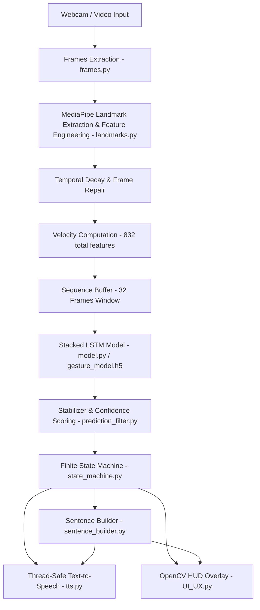

# SignBridge 🤟🌉

**SignBridge** is a real-time American Sign Language (ASL) gesture recognition, sentence assembly, and text-to-speech translation system. Built using OpenCV, MediaPipe, dynamic spatial-temporal feature engineering, and 2-layer LSTM neural networks in TensorFlow/Keras, SignBridge captures video streams, extracts high-dimensional hand landmarks and kinematic velocity metrics, translates continuous signs into text sentences, and reads them out using a thread-safe TTS engine.

---

## 🌟 Key Features

- **Real-Time Landmark Extraction & Feature Engineering**: Extracts 21 3D hand keypoints per hand (up to 2 hands) using MediaPipe, generating normalized wrist-relative coordinates, 60 bone vectors, 19 joint angles, and centroid calculations (416 base features + 416 velocity features = 832 total dimensions per frame).
- **Temporal Noise Decay & Frame Repair**: Seamlessly handles missing detections with decay-based pseudo-random noise drift and automated frame repairing (`repair_frames`).
- **Data Augmentation Pipeline**: Enhances raw video dataset samples using spatial noise injection, temporal warping, scale-and-shift adjustments, and sequence validation metrics.
- **Deep LSTM Sequence Model**: Stacked LSTM architecture (64 units per layer) with dropout regularization, class weight balancing, warm-up learning rate scheduling, and label smoothing. Supports initial training and fine-tuning modes.
- **Multi-Stage Post-Processing & Filtering**:
  - **Stabilizer (`prediction_filter.py`)**: Weighted sliding window buffer filtering transient noise and false positives.
  - **Finite State Machine (`state_machine.py`)**: Transitions cleanly across `IDLE` ➔ `DETECTING` ➔ `CONFIRMED` ➔ `COOLDOWN` states to ensure smooth emissions.
  - **Sentence Builder (`sentence_builder.py`)**: Assembles words into natural multi-line sentences with pause-based line finalization and inactivity expiration.
- **Thread-Safe Text-to-Speech (TTS)**: Non-blocking async speech synthesizer using `pyttsx3` with duplicate word suppression and cooldown timer protection.
- **Interactive Data Collector**: Custom UI utility to record custom ASL dataset sequences directly from webcam streams.
- **Modern Semi-Transparent HUD (`UI_UX.py`)**: OpenCV visual interface showing real-time detected glosses, dynamic confidence progress bars, scrolling sentence history, and state machine status.

---

## 🏗️ System Architecture



---

## 📂 Project Structure

```
SignBridge/
├── dataset/                   # Processed sequence data (.npy files per class)
├── Get_data/
│   ├── data_collection.py     # Live webcam data collection script
│   └── Documentation.md       # Data collection guide
├── model/                     # Saved Keras models (gesture_model.h5, fine_tuned_model.h5)
├── Scripts/
│   ├── augment.py             # Data augmentation routines (spatial noise, temporal warp, scaling)
│   ├── build_dataset.py       # Dataset builder for WLASL JSON & raw video processing
│   ├── clean_dataset.py       # Quality metrics validation (valid ratio, diversity ratio, repair threshold)
│   ├── count-gloss_videos.py  # Dataset statistics script
│   ├── frames.py              # Video frame sampler & resizer
│   ├── landmarks.py           # MediaPipe keypoint extractor & 416-dim feature engineer
│   ├── model.py               # LSTM training & fine-tuning script
│   ├── prediction_filter.py   # Multi-frame confidence stabilizer
│   ├── sentence_builder.py    # Temporal sentence constructor with pause & decay mechanics
│   ├── state_machine.py       # FSM for gesture emission lifecycle control
│   ├── tts.py                 # Asynchronous thread-safe Text-to-Speech engine
│   ├── UI_UX.py               # Semi-transparent HUD overlay renderer
│   └── video.py               # Main real-time inference pipeline
├── main.py                    # Project entry point
├── pyproject.toml             # Project dependencies & environment definition
└── README.md                  # Project documentation
```

---

## 🎯 Target Vocabulary

SignBridge is pre-configured to process 17 core operational ASL glosses:

`yes`, `no`, `wait`, `go`, `stop`, `help`, `want`, `need`, `like`, `good`, `bad`, `eat`, `drink`, `book`, `please`, `hello`, `talk`

---

## 🚀 Installation & Setup

### Prerequisites

- Python `>= 3.11, < 3.12`
- OpenCV compatible camera / webcam (`/dev/video0` or V4L2 device)
- `uv` (recommended) or `pip` / `venv`

### 1. Clone & Set Up Environment

Using `uv` (recommended):
```bash
git clone https://github.com/your-username/SignBridge.git
cd SignBridge
uv sync
source .venv/bin/activate
```

Or using `pip`:
```bash
python3.11 -m venv .venv
source .venv/bin/activate
pip install -r pyproject.toml
```

### 2. Verify Key Dependencies
- `mediapipe == 0.10.9`
- `tensorflow >= 2.14.0`
- `opencv-python`
- `pyttsx3`
- `scikit-learn`

---

## 💻 Usage Guide

### 1. Run Real-Time Webcam Translation
Run the main real-time recognition loop with live camera feed, post-processing stabilizer, visual HUD, and TTS voice response:

```bash
python Scripts/video.py
```
*Press `q` on the OpenCV window to exit.*

### 2. Build Dataset from WLASL
To extract, engineer features, repair, and augment sequences from the WLASL dataset:

```bash
python Scripts/build_dataset.py
```

### 3. Custom Data Collection
Collect your own custom dataset samples via webcam interactively:

```bash
python Get_data/data_collection.py
```
**Controls**:
- `r`: Start recording sequence
- `p`: Pause recording
- `n`: Next vocabulary word
- `b`: Previous vocabulary word
- `q`: Quit

### 4. Train or Fine-Tune the LSTM Model

**Train from scratch**:
```bash
python Scripts/model.py train
```

**Fine-tune existing model weights**:
```bash
python Scripts/model.py finetune
```

---

## 🔬 How Feature Engineering Works

Each sequence unit consists of **32 frames**. For each frame:
1. **Raw Coordinates**: Extracts $(x, y, z)$ coordinates for 21 joints across 2 hands ($2 \times 21 \times 3 = 126$ raw values).
2. **Wrist Normalization**: Coordinates are offset relative to the wrist $(x_0, y_0, z_0)$ and scaled by middle metacarpal distance.
3. **Bone Vectors**: Computes displacement vectors between consecutive joints (60 features).
4. **Joint Angles**: Calculates cosine angles between adjacent bone segments (19 features).
5. **Centroid**: Tracks geometric hand center relative to normalized space (3 features).
6. **Total Base Landmarks**: 416 features per frame.
7. **Velocity Vectors**: $\text{Velocity}_t = \text{Landmarks}_t - \text{Landmarks}_{t-1}$ (416 features).
8. **Final Feature Representation**: $416 + 416 = \mathbf{832}$ features per frame, forming a $(32, 832)$ input tensor per sign sequence.

---

## 📜 License

This project is open source and available under the standard MIT License.
